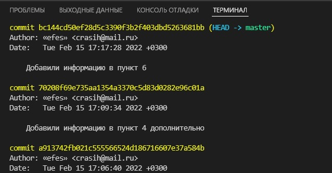
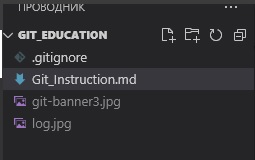
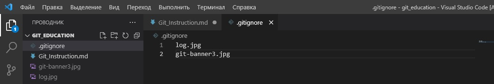
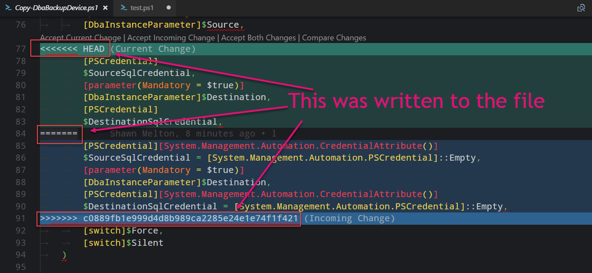

# Работа с git

## 1. Проверка наличия установленного git

В терминале выполнить команду  `git version`
Если git установлен появится сообщение с информацией  о версии программы. Иначе будет сообщение об ошибке.

## 2. Установка git.
Загружаем поледнюю версию git с сайта https://git-scm.com/downloads

## 3. Настройка git.
После установки необходимо «представиться» системе контроля версий. Это нужно сделать всего один раз, и git запомнит вас. Для этого нужно ввести в терминале 2 команды:
```
git config --global user.name «Ваше имя англ буквами»

git config --global user.email ваша_почта@example.com
```

Данные не проверяются, то есть вы можете указать любую почту и тем более любое имя. Но лучше написать реальные данные или, как минимум что-то осмысленное). Эти данные будут указываться, когда вы будете делать коммиты (о них подробнее на лекции), а указание реальных данных упростит командную работу.

## 4. Инициализация репозитория.
Команда `git init` создает новый репозиторий Git. С ее помощью можно преобразовать существующий проект без управления версиями в репозиторий Git или инициализировать новый пустой репозиторий. Большинство остальных команд Git невозможно использовать без инициализации репозитория, поэтому данная команда обычно выполняется первой в рамках нового проекта.
## 5. Запись изменений в репозиторий.
Команда `git add` добавляет изменение из рабочего каталога в раздел проиндексированных файлов. Она сообщает Git, что вы хотите включить изменения в конкретном файле в следующий коммит. Однако на самом деле команда **git add** не оказывает существенного влияния на репозиторий: изменения регистрируются в нем только после выполнения команды **git commit**.

Наряду с этими командами вам понадобится команда git status, которая показывает состояние рабочего каталога и раздела проиндексированных файлов.
Основной инструмент, используемый для определения, какие файлы в каком состоянии находятся — это команда `git status`. Если вы выполните эту команду сразу после клонирования, вы увидите что-то вроде этого:
```
$ git status
On branch master
Your branch is up-to-date with 'origin/master'.
nothing to commit, working tree clean
```
Это означает, что у вас чистый рабочий каталог, другими словами — в нем нет отслеживаемых измененных файлов. Git также не обнаружил неотслеживаемых файлов, в противном случае они бы были перечислены здесь. Наконец, команда сообщает вам на какой ветке вы находитесь и сообщает вам, что она не расходится с веткой на сервере. Пока что это всегда ветка master, ветка по умолчанию; в этой главе это не важно.
## 6. Просмотр истории коммитов.
Распространённые опции для команды `git commit`.
```
git commit
```
Коммит проиндексированного состояния кода. Эта команда откроет текстовый редактор с предложением ввести комментарий к коммиту. После ввода комментария сохраните файл и закройте текстовый редактор, чтобы выполнить коммит.

```
git commit -a
```
Выполнение коммита состояния со всеми изменениями в рабочем каталоге. Эта команда включает только изменения отслеживаемых файлов (тех, которые были в какой-то момент добавлены в историю с помощью команды git add).

```
git commit -m "commit message"
```
Быстрая команда, которая создает коммит с указанным комментарием. По умолчанию команда git commit открывает локально настроенный текстовый редактор с предложением ввести комментарий к коммиту. При передаче параметра -m текстовый редактор не открывается, а используется подставленный комментарий.

```
git commit -am "commit message"
```
Команда для опытных пользователей с параметрами -a и -m. Эта комбинация параметров создает коммит всех **не** проиндексированных изменений и добавляет к коммиту подставленный комментарий.

После того, как вы создали несколько коммитов или же клонировали репозиторий с уже существующей историей коммитов, вероятно вам понадобится возможность посмотреть что было сделано — историю коммитов. Одним из основных и наиболее мощных инструментов для этого является команда `git log`.


По умолчанию (без аргументов) `git log` перечисляет коммиты, сделанные в репозитории в обратном к хронологическому порядке — последние коммиты находятся вверху.
## 7. Перемещение между сохранениями.
Для перемещения между коммиитами необходимо использовать команду git checkout. Используется она следующим образом в папке с репозиторием: 
```
git checkout <номер коммита>.(Его код SHA)
```
Для перехода в предыдущую ветку (т. е. ту, из которой вы перешли в текущую) можно передать команде `git checkout` не имя ветки, а просто дефис:
```
git checkout -
```
Перемещение в первоначальный **commit** то есть _последний_ обязательно, для сохранения всей проделанной работы и её оптимального и актуального продолжения.


## 8. Игнорирование файлов.
Обычно правила игнорирования Git задаются в файле **.gitignore** в корневом каталоге репозитория. Тем не менее вы можете определить несколько файлов .gitignore в разных каталогах репозитория. Каждый шаблон из конкретного файла .gitignore проверяется относительно каталога, в котором содержится этот файл. Однако проще всего (и этот подход рекомендуется в качестве общего соглашения) определить один файл **.gitignore** в корневом каталоге. После регистрации файла .gitignore для него, как и для любого другого файла в репозитории, включается контроль версий, а после публикации с помощью команды push он становится доступен остальным участникам команды. В файл **.gitignore**, как правило, включаются только те шаблоны, которые будут полезны другим пользователям репозитория.
Прилагаю изображения:

_На первом рисунке сама вставка в папки в общий каталог._



_На втором рисунке её содержимое._



## 9. Создание веток в git.
Ветка Git - это простой перемещаемый указатель на один из коммитов, обычно последний в цепочке коммитов.
По умолчанию имя основной ветки - master.
Создать ветку можно командой 
```
git branch <Имя новой ветки>
```
Что бы при создании ветки сразу на неё переключиться, используется команда
```
git checkout -b <Имя новой ветки>
```
В результате создается новый указатель ни текущий коммит.

Список веток в репозитории можно посмотреть с помощью команды `git branch`.
## 10. Слияние веток и разрешение конфликтов.
Для слияние выбранной ветки с текущей нужно выполнить команду 
`git merge <Название выбранной ветки>`

Если была изменена одна и та же часть файла, в обеих ветках, то может возникнуть конфликт, который потребует участия пользователя.
Таким обрзом, пример на рисунке снизу, Git даст нам выбор из 4 вариантов:
1. Оставить текущее значение (в основной ветке куда присоединяем ветку)
2. Оставить вошедшее значение (информацию из сливаемой ветки)
3. Оставить оба варианта значений (из основной и второстепенной ветки)
4. Или же дает сравнить значения и выбрать верное.


## 11. Удаление веток.
Чтобы удалить локальную ветку в Git нужно выполнить команду (вместо mybranch необходимо поставить название ветки, которую вы хотите удалить):
```
git branch -d <название ветки>
```
Обратите внимание на то, что ветка, которую вы удаляете, не должна быть вашей текущей веткой, в которой вы работаете, иначе отобразится ошибка вида:

`error: Cannot delete branch ’mybranch’ checked out at ’/path/to`

Поэтому, если вам нужно удалить текущую ветку, то сначала нужно переключиться на какую-либо другую ветку, а только потом выполнять удаление.

Если вдруг возникает ошибка: 

`The branch ’mybranch’ is not fully merged. If you are sure you want to delete it`

и вы по прежнему хотите удалить ветку, то для принудительного удаления ветки можно воспользоваться опцией `-D` (принудительное удаление):
```
git branch -D <название ветки>
```
## 12. Работа с удалёнными репозиториями.
1. Создать аккаунт на `GitHub.com`
2. Создать локальный репозиторий.
3. Связать удалённый репозиторий с локальным.
4. Отправить (push) ваш локальный репозиторий в удалённый на (GitHub), при этом не забыть пройти авторизацию(только 1 раз).
5. Произвести изменения на сайте.
6. Если понадобиться, выкачать (pull) обратно на локальный компьютер.

Комманда `git clone` позволяет скопировать(склонировать) внешний репозиторий на ваш Пк.

Комманда `git pull` позволяет скачать всё из текущего репозитория и автоматически сделать `merge` с вашей версией.

Комманда `git push` позволяет отправить нашу версию репозитория на внешний. Требует **Авторизации** на внешнем репозитории.

## 13. Как сделать Pull Request.
1. Делаем Fork репозитория.
2. Делаем clone своей версии репозитория.
3. Создаём **новую** ветку и в неё вносим свои изменения.
4. Фиксируем изменения(делаем commit)
5. Отправляем свою версию в свой GitHub.
6. На сайте GitHub нажимаем кнопку Pull Request.